# Radar Signal Characterization

This project implements an AI-based radar signal characterization using the RadChar dataset. The project includes data loading, preprocessing, model training, and evaluation. It uses TensorFlow and Keras for building and training the neural network models.

## Project Structure
- `data/`: Contains the RadChar dataset.
  - `RadChar-Tiny.h5`: The dataset file containing radar signal data and labels.
- `models/`: Directory for saving trained models.
- `plots/`: Directory for saving generated plots.
- `src/`: Source code directory.
  - `hyperparameters.py`: Defines the hyperparameters for training.
  - `load_data.py`: Functions for loading and preprocessing the dataset.
  - `train_model.py`: Script for training the model.
- `requirements.txt`: Lists the dependencies required to run the project.

## Directory Structure
Below is the tree structure of the project directory:

```
Radar_Signal_Characterization/
├── data/
│   └── RadChar-Tiny.h5
├── models/
├── plots/
├── src/
│   ├── hyperparameters.py
│   ├── load_data.py
│   └── train_model.py
├── requirements.txt
└── README.md
```

## Requirements
To replicate this project, you need the following dependencies:
- h5py
- numpy
- matplotlib
- tensorflow
- keras
- scikit-learn
- seaborn

You can install all the dependencies using the following command:
```sh
pip3 install -r requirements.txt
```

## How to Run

### Step 1: Clone the Repository
First, clone the repository from GitHub:
```sh
git clone https://github.com/danyalwg/Radar_Signal_Characterization.git
cd Radar_Signal_Characterization
```

### Step 2: Download the Dataset
Download the RadChar dataset from [here](https://github.com/abcxyzi/RadChar.git) and place it in the `data` directory.

### Step 3: Install Dependencies
Install the required packages:
```sh
pip3 install -r requirements.txt
```

### Step 4: Run the Training Script
Run the training script:
```sh
python3 src/train_model.py
```
Note: Ensure that the dataset path in the `train_model.py` file is correctly set to the actual path where the dataset is located.

## Dataset
The RadChar dataset is a synthetic radar signal dataset designed to facilitate the development of multi-task learning models. It contains pulsed radar signals at varying signal-to-noise ratios (SNRs) between -20 to 20 dB. Each dataset comprises a total of 5 radar signal types each covering 4 unique signal parameters. The sampling rate used in RadChar is 3.2 MHz. Each waveform in the dataset contains 512 complex, baseband IQ samples.

### Signal Types
- Barker codes, up to a code length of 13
- Polyphase Barker codes, up to a code length of 13
- Frank codes, up to a code length of 16
- Linear frequency-modulated (LFM) pulses
- Coherent unmodulated pulse trains

### Signal Parameters
- Number of pulses, sampled between uniform range 2 to 6
- Pulse width, sampled between uniform range 10 to 16 µs
- Pulse repetition interval (PRI), sampled between uniform range 17 to 23 µs
- Pulse time delay, sampled between uniform range 1 to 10 µs

## Source Code Details

### hyperparameters.py
This file defines the hyperparameters for training the model. It sets parameters like the number of epochs, batch size, learning rate, and dropout rate.

### load_data.py
This file contains functions to load and preprocess the RadChar dataset.
1. **Loading Data**: Reads the IQ data and labels from the dataset file.
2. **Preprocessing Data**: Splits the real and imaginary parts of the IQ data into two channels, then splits the data into training and validation sets.

### train_model.py
This file handles the training of the machine learning model.
1. **Check GPU Availability**: Checks if a GPU is available and uses it if possible.
2. **Load and Preprocess Data**: Uses functions from `load_data.py` to load and preprocess the dataset.
3. **Model Architecture**: Defines a Convolutional Neural Network (CNN) with residual blocks and an attention layer.
4. **Training the Model**: Compiles and trains the model using the preprocessed data. It includes callbacks for early stopping, learning rate reduction, and model checkpointing.
5. **Evaluation and Plotting**: Generates plots for training/validation accuracy and loss, confusion matrix, precision-recall curve, and ROC curve.

## Architecture Overview

The architecture for this radar signal characterization project is designed using a combination of advanced neural network techniques, including Convolutional Neural Networks (CNNs), residual blocks, and attention mechanisms. This sophisticated structure allows the model to effectively process and classify complex radar signal data. Below is an in-depth explanation of each component and process.

### Concepts Used
1. **Convolutional Neural Networks (CNNs)**:
   - **Purpose**: CNNs are excellent for processing data with grid-like topology, such as images and signals.
   - **Functionality**: They use convolutional layers to apply filters across the input data, capturing local patterns and features. Each convolution operation produces a feature map highlighting specific features in the data.

2. **Residual Blocks**:
   - **Purpose**: Enable training of deeper networks by addressing the vanishing gradient problem.
   - **Functionality**: Each residual block includes a series of convolutional layers and adds the input of the block to its output. This skip connection allows the network to learn residual functions, improving training efficiency and accuracy.

3. **Attention Mechanisms**:
   - **Purpose**: Enhance the model's ability to focus on the most relevant parts of the input data.
   - **Functionality**: The attention layer computes a weighted sum of the input features, emphasizing important features while suppressing less relevant ones. This helps the model make more informed decisions based on the most critical parts of the data.

4. **Batch Normalization**:
   - **Purpose**: Stabilize and accelerate the training process.
   - **Functionality**: Batch normalization normalizes the inputs of each layer so that they have a mean of zero and a variance of one. This helps in maintaining a consistent distribution of inputs throughout the network, making training faster and more stable.

5. **Dropout**:
   - **Purpose**: Prevent overfitting.
   - **Functionality**: Dropout randomly drops units (neurons) during the training process, forcing the network to learn redundant representations. This enhances the model's generalization ability by preventing it from relying too heavily on specific neurons.

### Data Loading and Preprocessing

1. **Loading Data**:
   - The data is stored in an HDF5 file (`RadChar-Tiny.h5`), which contains complex IQ samples and corresponding labels.
   - The `h5py` library is used to load the IQ data and labels from the dataset file.
   - The dataset includes radar signal data with various signal types and parameters.

2. **Preprocessing Data**:
   - **Splitting Channels**: The real and imaginary parts of the IQ samples are split into two separate channels.
   - **Stacking Channels**: These channels are then stacked to form the input data, with each sample having two channels: one for the real part and one for the imaginary part.
   - **One-Hot Encoding**: The labels are converted to categorical format using one-hot encoding.
   - **Data Splitting**: The data is split into training and validation sets using an 80/20 split, ensuring a proper distribution of samples for model evaluation.

### Model Architecture

1. **Input Layer**:
   - **Shape**: Accepts data with a shape corresponding to the number of IQ samples and two channels (real and imaginary).
   - **Functionality**: This layer serves as the entry point for the data into the network.

2. **Convolutional Layers**:
   - **Initial Convolution**: The first layer applies a 1D convolution to extract features from the input data.
   - **Feature Extraction**: Subsequent convolutional layers use filters to slide over the input data and apply the convolution operation, capturing local patterns.
   - **Activation**: ReLU activation functions are applied to introduce non-linearity.

3. **Residual Blocks**:
   - **Composition**: Each residual block consists of two convolutional layers with batch normalization and ReLU activation.
   - **Skip Connections**: A skip connection adds the input of the block to its output, allowing the network to learn residual functions.
   - **Purpose**: These blocks help in building deeper networks by addressing the vanishing gradient problem and enhancing feature learning.

4. **Attention Layer**:
   - **Mechanism**: An attention mechanism is applied to the output of the residual blocks.
   - **Functionality**: The attention layer helps the model focus on the most relevant parts of the feature maps, improving its ability to make accurate predictions.

5. **Pooling Layers**:
   - **MaxPooling**: MaxPooling layers are used to downsample the feature maps, reducing their spatial dimensions while retaining the most important features.
   - **Purpose**: This helps in reducing the computational complexity and prevents overfitting.

6. **Fully Connected Layers**:
   - **Flattening**: The flattened output of the final pooling layer is passed through fully connected (dense) layers.
   - **Dropout**: Dropout is applied to prevent overfitting by randomly dropping units during the training process.
   - **Activation**: Dense layers use ReLU activation for intermediate layers and softmax activation for the output layer to produce a probability distribution over the classes.

7. **Output Layer**:
   - **Softmax Activation**: The output layer uses a softmax activation function to produce a probability distribution over the classes, enabling the model to make multi-class predictions.

### Training Process

1. **Compilation**:
   - **Optimizer**: The model is compiled with the Adam optimizer, known for its efficiency in handling sparse gradients and its adaptive learning rate.
   - **Loss Function**: Categorical cross-entropy loss is used, suitable for multi-class classification tasks.
   - **Metrics**: Accuracy is used as the primary metric to evaluate the model's performance.

2. **Callbacks**:
   - **ModelCheckpoint**: Saves the best model and the last checkpoint during training. This ensures that the best performing model is retained and training can be resumed from the last checkpoint if interrupted.
   - **EarlyStopping**: Stops training when the validation loss stops improving, preventing overfitting and saving computational resources.
   - **ReduceLROnPlateau**: Reduces the learning rate when the validation loss plateaus, allowing the model to fine-tune its weights for better performance.
   - **Custom Callback**: Prints training progress, providing real-time feedback on the model's performance.

3. **Training**:
   - **Data Feeding**: The model is trained on the training data and validated on the validation data.
   - **Epochs**: The training process involves multiple epochs, during which the model iteratively adjusts its weights to minimize the loss.
   - **Batch Size**: Training is done in batches to efficiently use memory and computational resources.

### Evaluation and Plotting

1. **Accuracy and Loss Plots**:
   - **Visualization**: Plots for training and validation accuracy and loss are generated to visualize the model's performance over time.
   - **Purpose**: These plots help in understanding how well the model is learning and if there are any signs of overfitting or underfitting.

2. **Confusion Matrix**:
   - **Generation**: A confusion matrix is generated to evaluate the model's classification performance.
   - **Purpose**: It provides a detailed breakdown of true positives, false positives, true negatives, and false negatives for each class, helping in diagnosing classification errors.

3. **Classification Report**:
   - **Metrics**: A classification report is generated to provide detailed metrics like precision, recall, and F1-score for each class.
   - **Purpose**: These metrics give a comprehensive view of the model's performance across different classes.

4. **Precision-Recall and ROC Curves**:
   - **Precision-Recall Curve**: Plotted to evaluate the trade-off between precision and recall for each class.
   - **ROC Curve**: Plotted to evaluate the true positive rate against the false positive rate for each class.
   - **Purpose**: These curves provide insights into the model's ability to distinguish between classes and its performance at different classification thresholds.

## Model Architecture
The model is built using a combination of Convolutional layers, residual blocks, and an attention layer. It uses the Adam optimizer and categorical cross-entropy loss for training. The model is designed to classify radar signals into different types.

### Model Architecture Diagram


## Training Process
The training process involves compiling the model, training it on the training data, and using callbacks to save the best model, apply early stopping, and reduce the learning rate on plateau.

### Training Process Diagram


## Evaluation
The model's performance is evaluated using a variety of metrics, including accuracy, precision, recall, and F1-score, as well as precision-recall and ROC curves.

### Evaluation Diagram


## Data Preprocessing
The data preprocessing steps include loading the data, splitting the real and imaginary parts of the IQ samples, stacking the channels, one-hot encoding the labels, and splitting the data into training and validation sets.

### Data Preprocessing Diagram


## Challenges Faced and Unique Features

### Challenges Faced

1. **Handling Complex Data**:
   - The dataset consists of complex IQ (In-phase and Quadrature) samples, which are inherently more challenging to process compared to simple numerical or categorical data. Each sample contains both real and imaginary parts, which must be correctly interpreted and utilized by the model.

2. **1D Data Structure**:
   - Unlike image data which is 2D, radar signal data is 1D. This requires a specialized approach in designing the neural network architecture. Convolutional layers and residual blocks need to be adapted to handle 1D data efficiently.

3. **Data Variability**:
   - The dataset includes a wide range of signal types and parameters, with varying signal-to-noise ratios (SNRs) from -20 to 20 dB. This variability can make it difficult for the model to learn generalized patterns, requiring robust preprocessing and a versatile model architecture.

4. **Balancing Accuracy and Computational Efficiency**:
   - Designing a model that is both accurate and computationally efficient is a significant challenge. The architecture must be complex enough to capture intricate patterns in the data but also efficient enough to be trained and deployed in a reasonable timeframe.

### Unique Features and Innovations

1. **Complex IQ Sample Handling**:
   - The architecture is specifically designed to handle the unique nature of radar signal data. By splitting the real and imaginary parts of the IQ samples into separate channels and then stacking them, the model can effectively process and learn from this complex data.

2. **1D Convolutional Layers**:
   - The use of 1D convolutional layers allows the model to capture temporal patterns in the radar signals. These layers slide filters over the input data to detect local patterns, which are crucial for identifying different signal types.

3. **Residual Blocks with Skip Connections**:
   - Incorporating residual blocks helps in building a deeper network without suffering from the vanishing gradient problem. The skip connections allow the network to learn residual functions, making training more efficient and improving overall performance.

4. **Attention Mechanisms**:
   - The inclusion of attention layers is a novel aspect of this architecture. These layers help the model focus on the most relevant parts of the input data, enhancing its ability to make accurate predictions by weighing important features more heavily.

5. **Comprehensive Preprocessing**:
   - The preprocessing steps ensure that the data is in an optimal format for training. Splitting the IQ samples into real and imaginary parts and performing one-hot encoding on labels ensures that the input data is well-structured and ready for the model.

6. **Robust Evaluation Metrics**:
   - The model's performance is evaluated using a variety of metrics, including accuracy, precision, recall, and F1-score, as well as precision-recall and ROC curves. This comprehensive evaluation ensures that the model is not only accurate but also robust across different classes.

### Achievement and Novelty

- **Attention-Enhanced Residual CNN**: The combination of residual blocks and attention mechanisms in a 1D CNN architecture is a novel approach for radar signal characterization. This design leverages the strengths of both techniques to create a model that is not only deep and powerful but also capable of focusing on the most critical features in the data.

- **Effective Handling of Complex Data**: Successfully processing and classifying complex IQ samples with varying SNRs demonstrates the robustness and versatility of the architecture. This capability is not commonly found in standard models, highlighting the innovative approach taken in this project.
